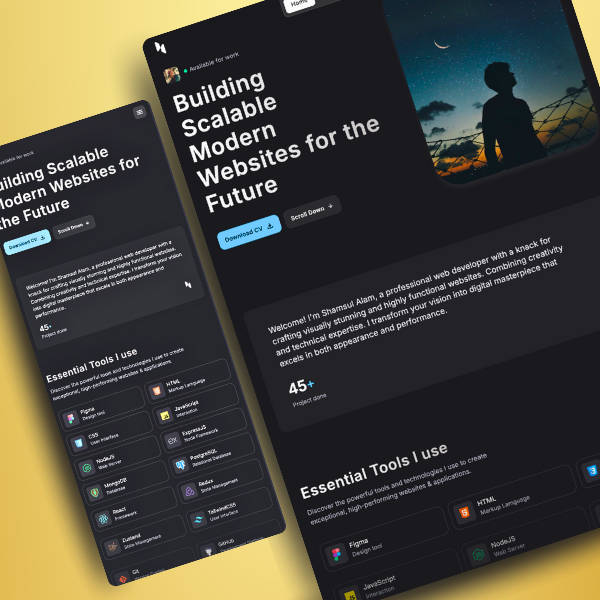

# React Portfolio

This is a personal portfolio website built with React. It showcases my projects, skills, and experience. The website is designed to be responsive and user-friendly.

## Technologies Used

- **React**: A JavaScript library for building user interfaces.
- **Tailwind CSS**: A utility-first CSS framework for styling.
- **GSAP**: A JavaScript library for creating animations.
- **React Intersection Observer**: A React hook for observing when elements enter or leave the viewport.
- **React Vertical Timeline Component**: A React component for creating vertical timelines.
- **Getform**: A form backend service for handling form submissions.
- **Vercel**: A platform for deploying and hosting websites.

## Features

- **Responsive Design**: The website is fully responsive and works on all devices.
- **Animated Transitions**: Smooth animations and transitions using GSAP.
- **Vertical Timeline**: A vertical timeline to showcase education and experience.
- **Contact Form**: A contact form that sends messages directly to my email using Getform.
- **Customizable Components**: Reusable and customizable React components.
- **Dark Mode**: A dark mode theme for better readability in low-light environments.

## Project Showcase

You can visit the live site at [https://www.smalam.com](https://www.smalam.com).

## Deployment

The website is deployed on Vercel with custome domain.
